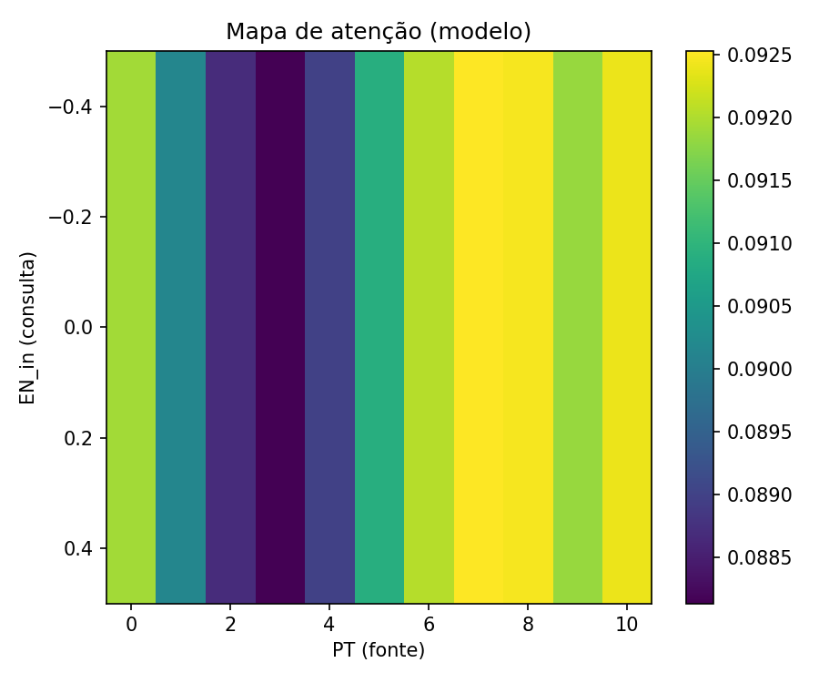

# Transformer PT→EN (TensorFlow / Keras)

Este repositório reproduz, de ponta a ponta, o tutorial oficial do TensorFlow para tradução Português → Inglês com a arquitetura Transformer. O objetivo foi entender a implementação do zero em Keras, treinar e inspecionar o modelo, comparar CPU × GPU com um protocolo consistente e registrar métricas, gráficos e percepções técnicas. Todo o processo foi versionado com commits significativos.

Links diretos
- Tutorial (PT-BR): https://www.tensorflow.org/text/tutorials/transformer?hl=pt-br
- Paper: Vaswani et al., 2017 — “Attention Is All You Need”

-------------------------------------------------------------------------------

Objetivo e dataset

A meta foi executar o tutorial com reprodutibilidade (ambiente, versões e passos), medir desempenho (tempo por época, tempo total) e uma métrica de qualidade mínima (SacreBLEU em amostra), além de documentar o que funcionou, o que exigiu cuidado e como evoluir o baseline.

Dataset utilizado: ted_hrlr_translate/pt_to_en via TensorFlow Datasets (TFDS). Uso acadêmico/experimental conforme os termos do TFDS.

-------------------------------------------------------------------------------

Abordagem adotada

O projeto parte do tutorial oficial, mas toma alguns cuidados práticos. Primeiro, as versões de TensorFlow e tensorflow-text foram pareadas 1:1 para garantir que os tokenizers em SavedModel carreguem sem falhas de operadores. Em seguida, montei um pipeline tf.data com shuffle, batch usando drop_remainder, tokenização subword PT/EN com corte por MAX_TOKENS e prefetch, mantendo shapes estáveis para evitar retracing e garantir throughput consistente.

O modelo segue a arquitetura Encoder–Decoder com atenção multi-cabeças, codificação posicional sen/cos, conexões residuais e LayerNorm. Em GPU, habilitei mixed precision e mantive a projeção de logits em float32 para estabilidade. A comparação de hardware foi feita com um protocolo curto e mensurável: na GPU (3 épocas, mixed_float16) e na CPU (1 época, float32), cronometrando cada época, registrando perdas e calculando SacreBLEU em n=100 sentenças de validação (decodificação greedy). Por fim, gerei artefatos para auditoria: curvas de loss, throughput (tokens/s) em forward, histograma de comprimentos de tokens, um mapa de atenção usando os pesos do decoder, amostras qualitativas em CSV e métricas consolidadas em JSON.

-------------------------------------------------------------------------------

Ambiente e dependências

Python 3.11 (Colab)
TensorFlow 2.19.0
tensorflow-text 2.19.0
Demais pacotes: tensorflow-datasets 4.9.6, sacrebleu 2.4.1, matplotlib 3.9.0, numpy 1.26.4, pandas 2.2.2, ipykernel 6.29.5, jupyterlab 4.2.4

requirements.txt (utilizado)
tensorflow==2.19.0
tensorflow-text==2.19.0
tensorflow-datasets==4.9.6
sacrebleu==2.4.1
matplotlib==3.9.0
numpy==1.26.4
pandas==2.2.2
ipykernel==6.29.5
jupyterlab==4.2.4

Observações de compatibilidade
- tensorflow-text deve casar exatamente com a versão do TensorFlow; caso contrário, o SavedModel dos tokenizers não carrega (ops não registrados).
- Em GPU local, alinhar versões de CUDA/cuDNN com a matriz do TF. No Colab, isso já vem configurado.

-------------------------------------------------------------------------------

Como executar (CPU e GPU)

Estrutura do repositório
.
├── README.md
├── requirements.txt
└── notebooks/
    └── tutorial_transformer.ipynb

Passos (Linux/Mac)
1) python -m venv .venv && source .venv/bin/activate
2) pip install -r requirements.txt
3) Abrir notebooks/tutorial_transformer.ipynb e executar as células em sequência.

Para GPU no Colab
- Runtime → Change runtime type → GPU.
- Mixed precision ativada automaticamente quando há GPU.
- Seeds fixadas para melhor reprodutibilidade (pequenas variações entre hardwares são esperadas).

Boas práticas aplicadas
- drop_remainder=True no batch para manter shapes fixos (menos retracing).
- Reconstrução limpa do modelo ao alternar GPU↔CPU, evitando conflito de variáveis alocadas em device diferente.

-------------------------------------------------------------------------------

Parâmetros e escolhas

A execução usou uma configuração rápida para produzir números em poucos minutos, preservando a lógica do tutorial.

Tabela de parâmetros
| Parâmetro         | Tutorial (referência) | Execução rápida (usada) | Observação                                               |
|-------------------|-----------------------|--------------------------|----------------------------------------------------------|
| num_layers        | 4                     | 1                        | Reduz custo por época                                    |
| d_model           | 128                   | 64                       | Menos parâmetros e memória                               |
| dff               | 512                   | 128                      | Proporcional a d_model                                   |
| num_heads         | 8                     | 4                        | d_model/heads = 16, divisão limpa                        |
| dropout           | 0.1                   | 0.1                      | Igual ao tutorial                                        |
| optimizer         | Adam + CustomSchedule | Adam + CustomSchedule    | Warmup + 1/√t                                            |
| MAX_TOKENS        | 64–128 (estudo)       | 32                       | Rápido; histograma mostra truncamento frequente          |
| batch_size        | 64 (depende do HW)    | 32                       | Cabe sem gargalos no Colab                               |
| decoding          | greedy                | greedy                   | Baseline comparável                                      |

-------------------------------------------------------------------------------

Resultados (CPU × GPU)

Protocolo padronizado: batch 32, MAX_TOKENS 32, steps/época 40 e val_steps 8; SacreBLEU em n=100 (tokenize="none", force=True); GPU com mixed_float16; CPU em float32.

Tabela comparativa
| Hardware | Épocas | Steps/época | Tempo/época (média) | Tempo total | Loss final | SacreBLEU (n) |
|---------:|:------:|:-----------:|:--------------------:|:-----------:|-----------:|:-------------:|
| GPU      | 3      | 40          | 1.55s               | 5.65s       | 7.5865     | 0.1040 (100)  |
| CPU      | 1      | 40          | 11.21s              | 20.95s      | 8.7602     | 0.1090 (100)  |

Leitura dos resultados

A GPU foi cerca de 7–8× mais rápida por época, como esperado para Transformer com atenção paralelizável e mixed precision. Mesmo com poucas épocas, a perda na GPU já cai visivelmente em relação ao aquecimento mínimo na CPU. O BLEU permanece modesto porque a avaliação foi feita com n pequeno e greedy; ele tende a subir com mais épocas, MAX_TOKENS maior e um decodificador mais forte (por exemplo, beam search).

-------------------------------------------------------------------------------

Gráficos e artefatos

Distribuição de comprimentos de tokens (PT/EN) em amostra

Mapa de atenção do modelo (média das cabeças na última camada do decoder)

Amostras qualitativas PT → EN
assets/amostras_traducoes.csv

Pacotes de métricas (auditoria e rastreabilidade)
assets/results_gpu.json  
assets/results_cpu.json  
assets/cpu_gpu_table.txt  
assets/metrics.json  
assets/throughput_forward.json  
assets/backprop_microbench.json

-------------------------------------------------------------------------------

Percepções pessoais

O que funcionou bem

A reprodutibilidade ficou sólida: usar TFDS e tokenizers em SavedModel eliminou a etapa frágil de “construir vocabulário” e tirou atrito na preparação dos dados. O pareamento das versões TF/tensorflow-text resolveu, de início, erros de operador que costumam interromper o fluxo. O scheduler com warmup e decaimento 1/√t estabilizou a perda mesmo no regime curto, e o uso de mixed precision em GPU trouxe ganhos diretos de throughput. Ter tempos por época, gráficos e JSONs facilitou revisar a execução e montar a comparação de hardware sem depender de prints dispersos.

O que exigiu cuidado

Versões desalinhadas entre TF e tensorflow-text impedem o carregamento dos tokenizers; manter versões casadas foi essencial. Ao alternar GPU↔CPU, reconstruir o modelo do zero evitou conflitos de variáveis alocadas no device errado. Para avaliação rápida, greedy resolve, mas limita a fluência; vale planejar beam search. Por fim, MAX_TOKENS=32 acelera, mas trunca frases com frequência — o histograma deixa isso explícito e justifica aumentar o limite nas próximas rodadas.

Trade-offs e gargalos

Com poucas épocas é possível comparar hardware de forma justa, mas o BLEU segue modesto; qualidade real aparece com treino mais longo e/ou decodificação melhor. Aumentar d_model e MAX_TOKENS melhora capacidade, porém eleva custo e memória. No input pipeline, manter shapes fixos (drop_remainder) e prefetch ajudou a sustentar o ritmo de passos e reduzir retracing.

-------------------------------------------------------------------------------

O que foi além do esperado

Reprodutibilidade prática: além de listar dependências, há requirements.txt e observações de compatibilidade (TF ↔ tensorflow-text), além de procedimentos para alternar hardware com segurança (recriação do modelo por device).

Avaliação objetiva e auditável: além de tempo e perda, inclui SacreBLEU em amostra; os artefatos (curvas, JSONs, CSV de amostras) permitem refazer leituras e checar números sem reexecutar tudo.

Instrumentação útil: gráficos adicionais (throughput e histograma de comprimentos) ajudam a interpretar gargalos de contexto e ritmo de execução; o mapa de atenção foi extraído dos pesos do decoder, e não apenas de uma MHA diagnóstica solta.

Padronização da comparação: protocolo CPU×GPU com batch, MAX_TOKENS, steps/época e val_steps alinhados, além de políticas numéricas (mixed_float16 na GPU e float32 na CPU) explicitadas.

-------------------------------------------------------------------------------

Próximos passos

Beam search (k=4) na inferência e comparação direta com greedy nos mesmos inputs.  
Aumentar MAX_TOKENS para 48–64 e treinar por mais 3–5 épocas na GPU; registrar deltas em BLEU e perda.  
Ativar XLA em GPU juntamente com mixed precision e relatar ganhos de throughput.  
Ablações leves (num_layers=2, d_model=256) para custo/benefício.  
Explorar KerasNLP para tokenização/camadas utilitárias e um pipeline mais integrado.  
Usar early stopping e checkpointing baseado em val_loss; avaliar BLEU no dev/test completo.

-------------------------------------------------------------------------------

Versionamento (evidências no Git)

1) chore(data): TFDS + tokenizers (SavedModel) + pipeline tf.data  
   - Download/carga do dataset, make_batches com shuffle/batch/prefetch, .gitignore para artefatos volumosos.

2) feat(model/train): Transformer + máscaras + scheduler + callbacks de tempo  
   - Encoder/Decoder, perdas e acurácia mascaradas, CustomSchedule, medição de tempo por época e salvamento de métricas.

3) feat(infer+docs): Inferência + gráficos + README com CPU×GPU  
   - Decodificação greedy, amostras qualitativas, imagens e documentação dos resultados comparativos.

-------------------------------------------------------------------------------

Referências

Tutorial TF Transformer (PT-BR): https://www.tensorflow.org/text/tutorials/transformer?hl=pt-br  
Vaswani et al. (2017). Attention Is All You Need.

Observação final

Este README acompanha um notebook que reproduz o tutorial e apresenta uma comparação objetiva entre CPU e GPU. Os artefatos em assets/ permitem auditar tempos, curvas, atenção e amostras. A partir deste baseline, os próximos passos (beam search, mais épocas, MAX_TOKENS maior e ablações) tendem a elevar a qualidade de tradução de forma mensurável.
